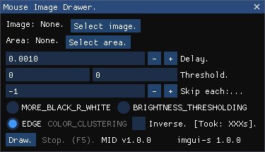

<h1 align="center">mouse_image_drawer v1.0.0 ALPHA</h1>

 <i>Turn image to mouse movements!</i>

Technologies used:
  <ul>
    <li><a href="https://github.com/pyimgui/pyimgui">PyImGui v2.0.0</a></li>
    <li><a href="https://github.com/xzripper/imgui_standalone">imgui_standalone v1.0.0</a></li>
    <li><a href="https://github.com/opencv/opencv-python">opencv-python v4.8.0.74</a></li>
    <li><a href="https://github.com/boppreh/keyboard">keyboard 0.13.5</a> & <a href="https://github.com/boppreh/keyboard">mouse v0.7.1</a></li>
    <li><a href="https://github.com/Delgan/loguru">loguru 0.6.0</a></li>
  </ul>

<kbd>V1.0.0-ALPHA MIT License (2024).</kbd>

